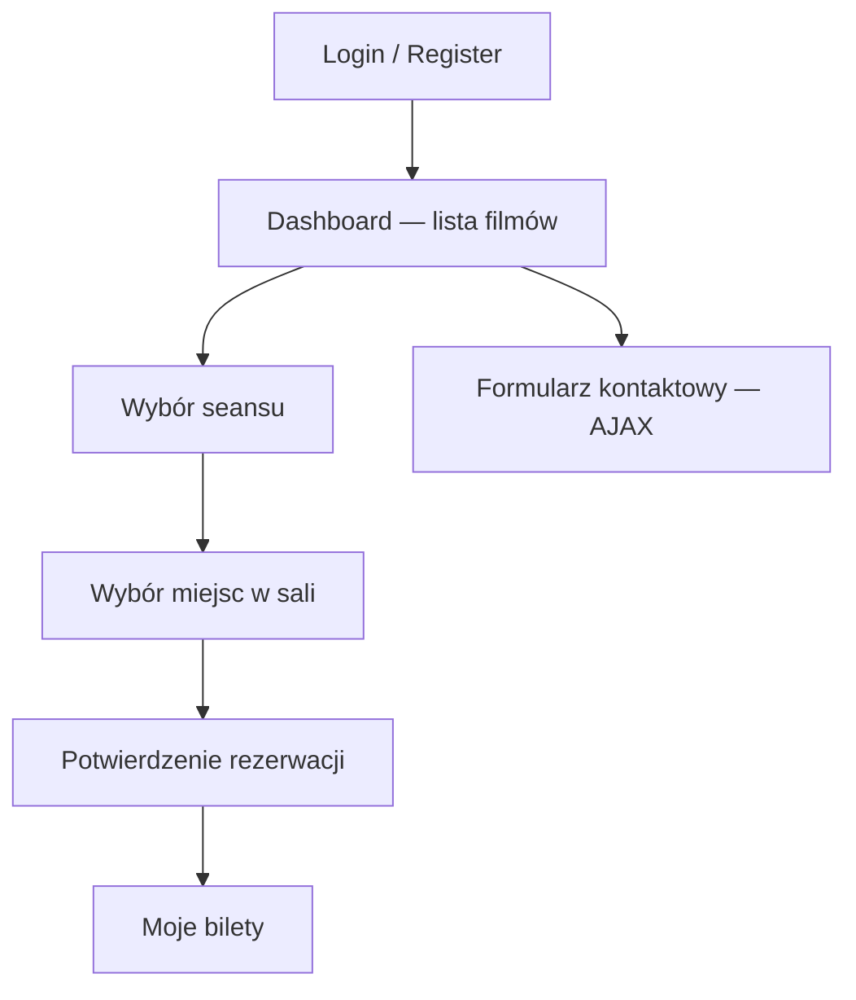
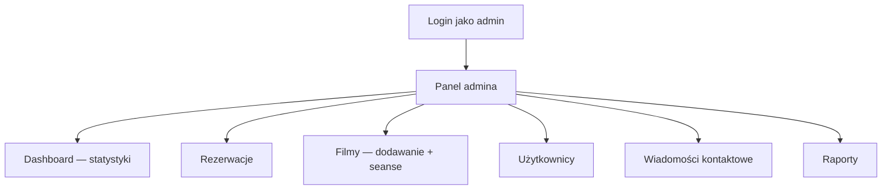
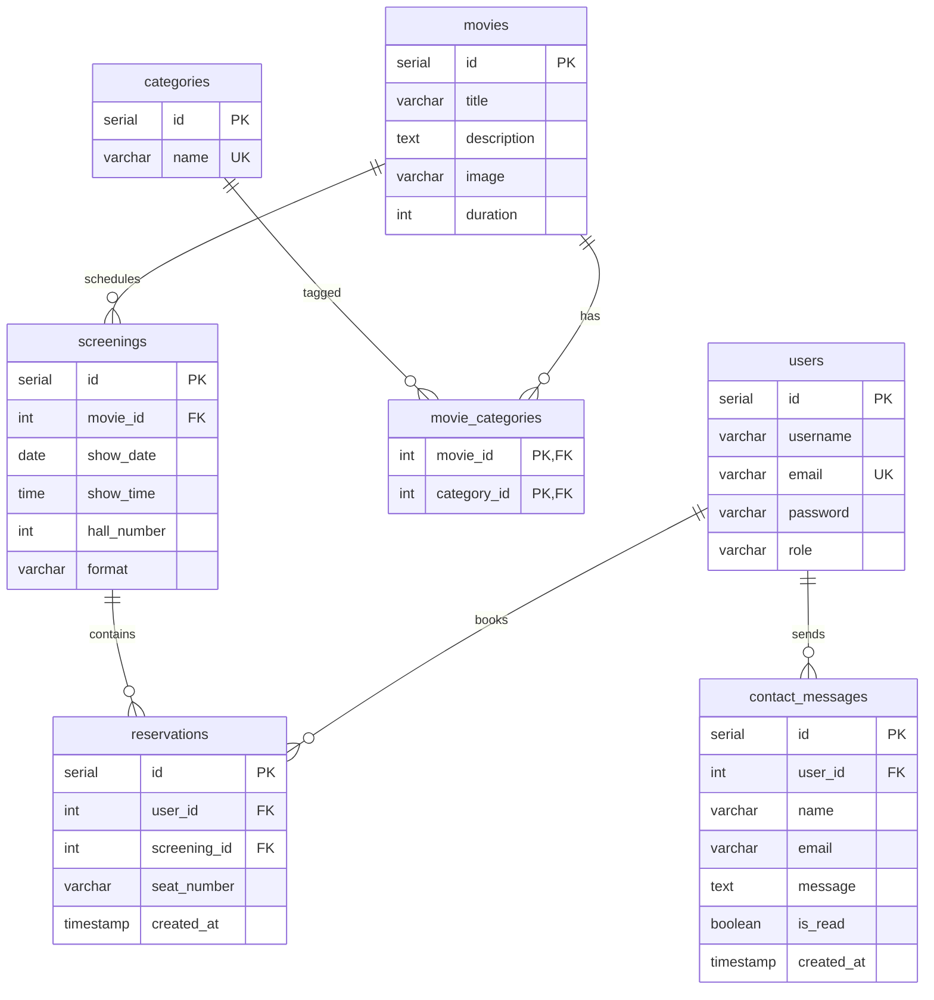
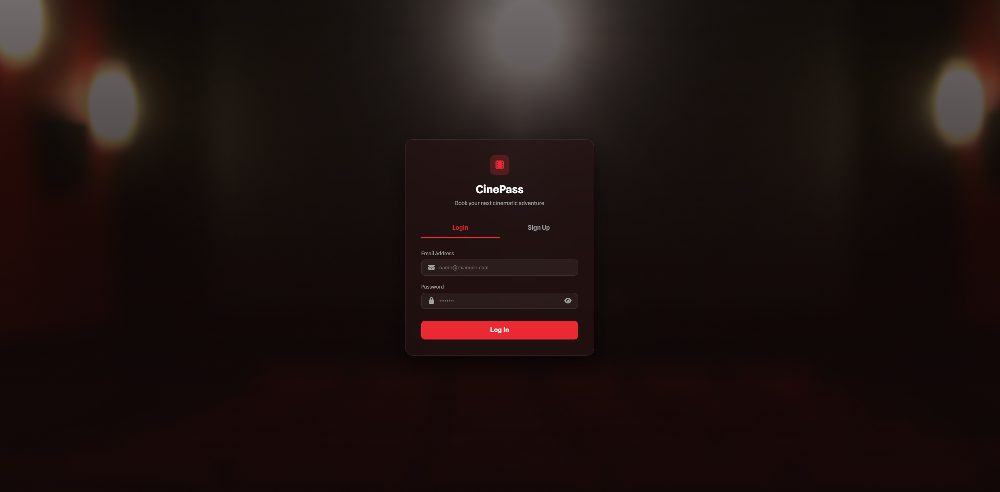
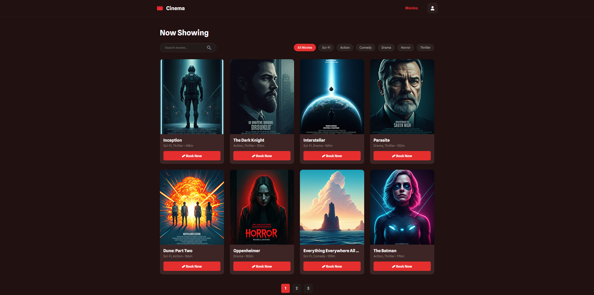
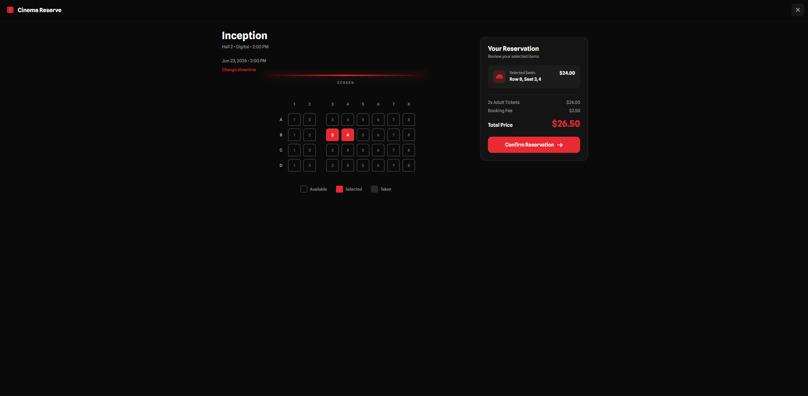
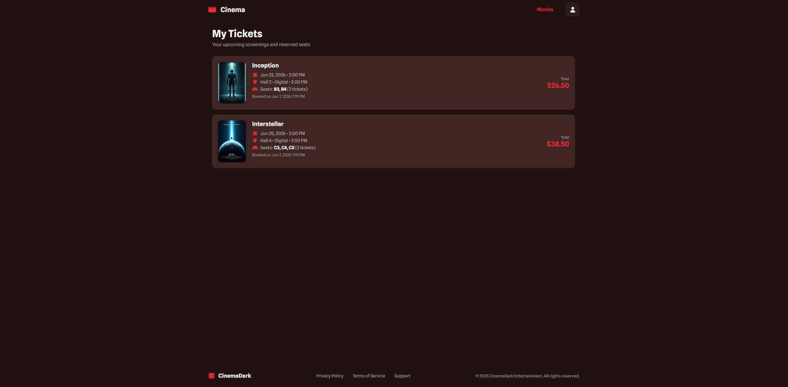
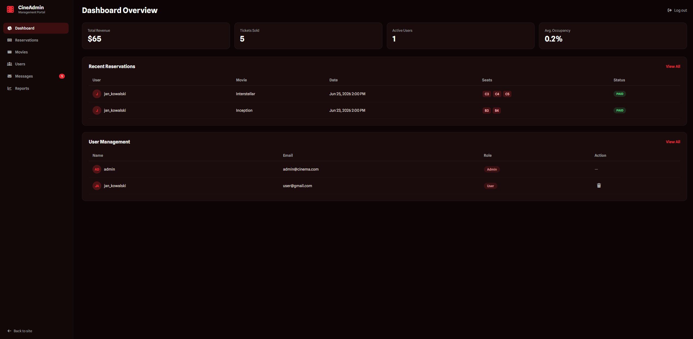
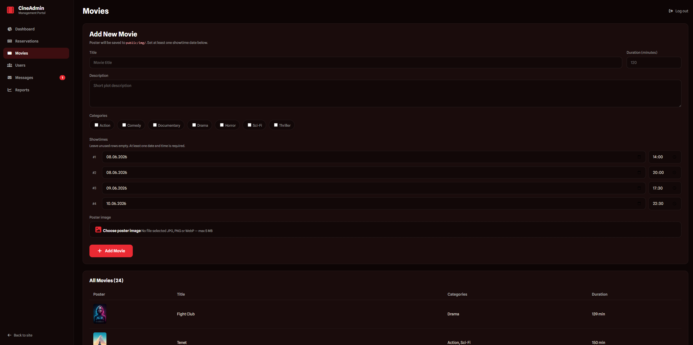

# CinePass — system rezerwacji biletów do kina

Aplikacja webowa do przeglądania filmów, rezerwacji miejsc na seanse i zarządzania kinem w panelu administratora.

## Technologie

| Warstwa | Stack |
|---------|--------|
| Backend | PHP 8.3, architektura MVC |
| Baza danych | PostgreSQL |
| Frontend | HTML, CSS, JavaScript |
| AJAX | Fetch API (`/contact`, `/reservation?format=json`) |
| Infrastruktura | Docker (nginx, PHP-FPM, PostgreSQL, pgAdmin) |

## Uruchomienie (Docker)

```bash
docker compose up -d --build
```

| Usługa | Adres |
|--------|--------|
| Aplikacja | http://localhost:8080 |
| PostgreSQL | `localhost:5433` (user: `docker`, hasło: `docker`, baza: `db`) |
| pgAdmin | http://localhost:5050 (`admin@example.com` / `admin`) |

Schemat i dane początkowe ładują się z `docker/db/init/init.sql` przy pierwszym starcie kontenera `db`.

### Reset bazy (od zera)

```bash
docker compose down -v
docker compose up -d
```

### Eksport bazy do pliku SQL

```bash
docker compose exec db pg_dump -U docker db > export.sql
```

## Konta testowe

| Rola | Email | Hasło |
|------|-------|-------|
| Admin | `admin@cinema.com` | `password123` |
| Użytkownik | `user@gmail.com` | `password123` |

## Flow aplikacji

### Użytkownik



### Administrator



## Architektura MVC

```
index.php          → punkt wejścia, sesja
Routing.php        → mapowanie URL → kontroler
src/controllers/   → logika HTTP (Security, Dashboard, Reservation…)
src/repositories/  → dostęp do bazy (Singleton + PDO)
src/models/        → encje (User, Movie, Screening…)
src/services/      → logika pomocnicza (CSRF, rate limit, walidacja hasła)
public/views/      → szablony HTML
public/css|js/     → frontend
```

Przykład przepływu rezerwacji:

1. `ReservationController` — obsługa żądania
2. `ScreeningRepository` / `MovieRepository` — odczyt seansu i filmu
3. `ReservationRepository` — transakcja INSERT + funkcja `fn_is_seat_available()`
4. `public/views/reservation.html` — widok sali

## Baza danych

### Diagram ERD



### Obiekty SQL

| Typ | Nazwa | Opis |
|-----|-------|------|
| VIEW | `v_user_tickets` | Zagregowane bilety użytkownika (używane w `ReservationRepository`) |
| FUNCTION | `fn_is_seat_available()` | Sprawdza dostępność miejsca na seansie |
| TRIGGER | `reservations_validate_seat` | Waliduje format miejsca (`A1`–`D8`) przed INSERT/UPDATE |

Źródło: `docker/db/init/init.sql`

## Zrzuty ekranu

### Logowanie



### Lista filmów (dashboard)



### Rezerwacja miejsc



### Moje bilety



### Panel administratora



### Dodawanie filmu (admin)



## Bezpieczeństwo (skrót)

- Hasła hashowane (`password_hash` / `password_verify`)
- Prepared statements (PDO) — ochrona przed SQL injection
- CSRF token w formularzach logowania i rejestracji
- Limit 5 nieudanych prób logowania → blokada 5 minut
- Walidacja złożoności hasła przy rejestracji
- Ogólny komunikat błędu logowania (bez ujawniania emaila)
- `htmlspecialchars()` w widokach (ochrona XSS)

## Struktura katalogów

```
wdpai/
├── docker/              # nginx, PHP, PostgreSQL
├── docs/
│   └── screenshots/     # zrzuty ekranu do README
├── public/
│   ├── css/
│   ├── js/
│   ├── img/
│   └── views/
├── src/
│   ├── controllers/
│   ├── models/
│   ├── repositories/
│   └── services/
├── docker-compose.yaml
├── index.php
└── Routing.php
```
